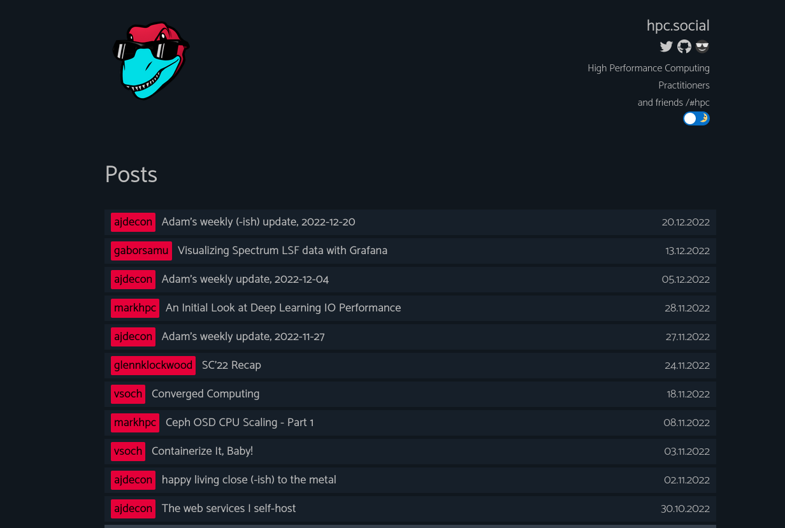

# hpc.social Community Syndicated Blog

This is the repository for the [syndicated blog](https://hpc.social/projects/blog/) for the hpc.social community!
Note that we have two flavors of blogs - an aggregated personal blog (here) along with a collection
of community blogs served from  [syndicated community blog](https://hpc.social/community-blog/).
The criteria for adding content feeds here is the following:

> The personal blogs aggregator is the "soul" of the HPC community - HPCers who are personally invested in the minutiae of the work they are doing, the projects they are working on with some content about their culture and pet pictures :D - things that we all find in common and share and talk about.

You can see the background for this discussion in [this thread](https://github.com/hpc-social/blog/pull/13).
Contribution steps are the equivalent across our community blogs, and you can
read about them [here](https://github.com/hpc-social/blog).
